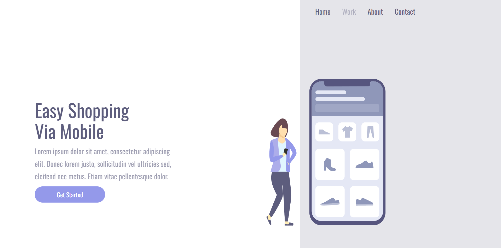
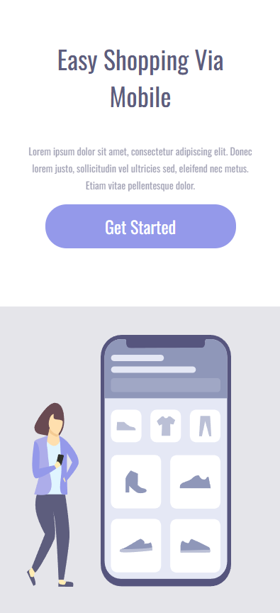

# 🚀 Projeto Desafio DevClub

Este projeto foi desenvolvido como parte de um desafio proposto pelo **DevClub**, com o objetivo de praticar HTML, CSS e JavaScript. O foco foi construir uma landing page moderna, responsiva e visualmente atrativa.

---

## 📸 Pré-visualização

### 🔹 Tela principal

### 🔹 Responsividade

---

## 🛠️ Tecnologias Utilizadas

- HTML5
- CSS3
- VS Code

---

## 🎯 Objetivo do Projeto

- Praticar estruturação com HTML semântico.
- Aplicar responsividade usando media queries.
- Estilização moderna com CSS.
- Treinar boas práticas de organização de código.
